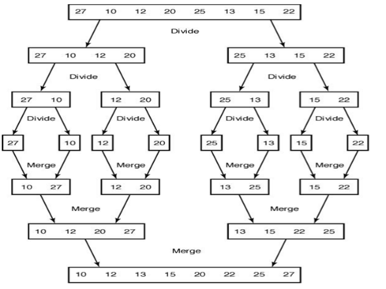
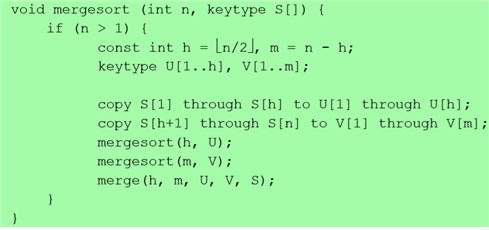
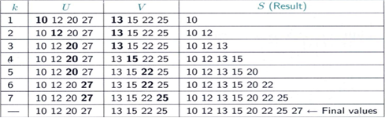
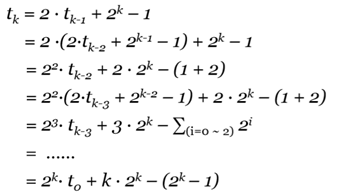
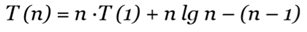

###3. 분할 정복 - 합병 정렬 (Merge Sort)
#### 1) 소개
(1) 정렬 알고리즘 중 가장 많이 사용하는 정렬 기법 
(2) Problem : 정렬이 되지 않은 n개의 key values를 정렬한다. 
(3) Input : 양의 정수 n (array size), S[1..n] (stored in unsorted key values) 
(4) Output : 정렬되어 있는 배열 S 

 [예시] 
 <tr>
#### 2) 성능 분석
  (1) 슈도 코드를 보기 
  <tr>
  (2) 점화식 짜기
   - 독립 변수로 n을, 종속 변수로 m, h를 준다. (m = n – h, h = )
   - basic of operation은 호출 횟수와 비교 횟수로 구성한다.

    “T(n) = 재귀 호출부 + 나머지 연산“으로 구성
      재귀 호출부 : T(m) + T(h)		나머지 연산 : merge()에서 비교 연산 횟수

    T(n) = T(m) + T(h) + merge()에서 비교 연산 횟수
        = T(└n/2┘) + T(┌n/2┐) + (n – 1) = 2 * T(n/2) + (n-1) (단, T(1) = 2 * T(1/2)이므로 T(1) = 0 )

     <가정>
      ① 만약 하나의 배열이 끝나면, 나머지 한 개의 배열은 그대로 S 배열에 옮기면 된다.
>*나머지 연산 과정 :  8개의 요소에서 총 7번의 비교 연산이 일어남 (worst case) 
  <tr>
  
  (2) 점화식을 worst case time complexity로 고치기 
      n = 2^k, k >= 0을 가정하면, “T(2^k) = 2* T(2^k) + (2^k-1)"이 나온다. 
      T(2^k) = t(k)로 치환하여 식을 변형시키면 “t(k) = 2* t(k-1) + t(k) - 1"이 나온다. 
      이를 일반화 공식으로 유도하고자 아래의 연산 과정을 거치면 
    <tr>
      위와 같은 일반화 공식이 성립됨을 알 수 있다.  
      여기서 다시 T(n) 식으로 변환시키면  이 된다. 
      따라서, 시간 복잡도 함수는
 #T(n) = n*log(n)